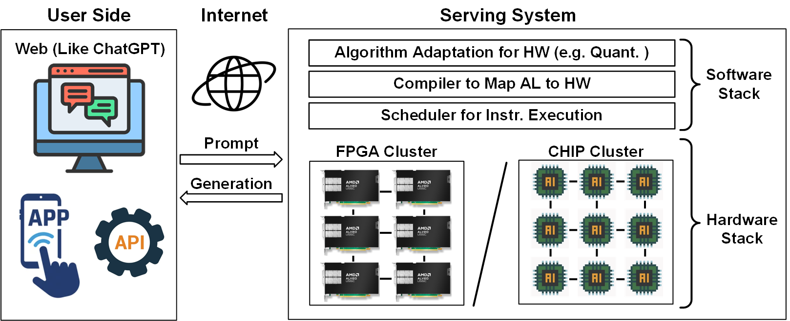








I am currently a Postdoctoral Fellow at the Duke Center for Computational Evolutionary Intelligence ([DCEI](https://cei.pratt.duke.edu/)), supervised by [Prof. Yiran Chen](https://cei.pratt.duke.edu/people/yiran-chen) and [Prof. Hai "Helen" Li](https://cei.pratt.duke.edu/people/hai-helen-li). I received the Ph. D. degree of Microelectronics and Solid-State Electronics in the School of integrated Circuits, Peking University, China, in Jan. 2024, supervised by [Prof. Hailong Jiao](https://www.ece.pku.edu.cn/info/1045/2719.htm) at [PKU-VLSI Lab](http://www.PKU-VLSI.com). I received the Bachelor degree of Microelectronics Science and Engineering from Sun Yat-sen University, Guangzhou, China, in Jul. 2018.  My research interest is energy-efficient AI chips for edge computing via cross-layer innovations, spanning from algorithms to architecture and circuit design. You can find more information through my [CV](https://github.com/zhouchch3/changchunzhou/blob/main/docs/CV.pdf). 

🔴 (**I am seeking collaboration in both research and engineering.**) If you are interested in me, please feel free to contact me at any time.

<!--My research interest includes neural machine translation and computer vision. I have published more than 100 papers at the top international AI conferences with total <a href='https://scholar.google.com/citations?user=DhtAFkwAAAAJ'>google scholar citations <strong>260000+</strong></a> (You can also use google scholar badge ).-->

# 🧭 Research Tracks

### 🚀 Chip Design for AI Acceleration
I work on designing customized chips that accelerate mainstream AI algorithms — including Diffusion models, Transformers, LLaMA, CNNs — for analysis and context generation for text, image, video, and point cloud.

### 🌐 Online AI Deployment Systems
I also develop online serving systems that enable AI deployment on FPGAs or out customized chip clusters, accessible via web platforms or mobile apps. This involves:
- Hardware-optimized algorithms
- AI hardware compilers (e.g., Google MLIR) to map algorithms to hardware instructions
- Schedulers for efficient task assignment

### ⚡ Impact & Clarification
- How is the better than existing general system? Running the same open-source AI models, we deliver up to **1000× lower purchase cost** and **100× lower electricity cost** compared to GPUs, while maintaining the same speed and accuracy.

# 📖 Educations
- *2018.09 - 2024.01*, Doctor of Philosophy in Microelectronics and Solid-State Electronics, Peking University, Beijing, China. Thesis Title: Research on On-Chip Neural Network Accelerators for 3D Understanding.
- *2014.09 - 2018.06*, Bachelor of Engineering in Microelectronics Science and Engineering, Sun Yat-sen University, Guangzhou, China.

<!--# 🔥 News
- *2022.02*: &nbsp;🎉🎉 Lorem ipsum dolor sit amet, consectetur adipiscing elit. Vivamus ornare aliquet ipsum, ac tempus justo dapibus sit amet. 
- *2022.02*: &nbsp;🎉🎉 Lorem ipsum dolor sit amet, consectetur adipiscing elit. Vivamus ornare aliquet ipsum, ac tempus justo dapibus sit amet. -->

# 🎖 Honors and Awards
- 12/2023 **Leo KoGuan Scholarship (1/157, ¥20, 000)**, *Peking University*                                                      
- 12/2023 **Exceptional Award for Academic Innovation**, *Peking University*                                           
- 12/2023 Merit Student, *Peking University*                                                                           
- 12/2022 Award for Scientific Research, *Peking University*                                                                         
- 10/2019 Merit Student, *Peking University*                                                                           
- 10/2016 National Inspirational Scholarship, *Sun Yat-sen University*                                                  
- 10/2015 National Inspirational Scholarship, *Sun Yat-sen University*                                                 
- 10/2015 First Class Scholarship, *Sun Yat-sen University*                                                            

# 🍀 Chip Gallery

# 📝 Publications 

TCAS-I 2026

[A CMOS Voltage Reference Featuring a Tandem Differential Structure With Two-Stage Stacked Diode-Connected MOSFETs Core](https://ieeexplore.ieee.org/document/11301867)

Q. Zhou, Y. Liu, K. Zeng, X. Zhu, **<u>C. Zhou</u>#** and Q. Hua#. (**#Corresponding Author**)

*EEE Transactions on Circuits and Systems I: Regular Papers (**TCAS-I**) (Accepted)*

Abstract

In this paper, A CMOS voltage reference (CVR) with two-stage self-biased stacked diode connected MOS transistors (SDMTs) which actively compensates for process, voltage, and temperature (PVT) variations via a tandem differential structure (TDS) is proposed. The SDMTs core biased by new pseudo cascode current mirror guarantees better suppression against supply change and generates two reference voltages. The TDS, composed of two tandem NMOS transistors, serves as an output stage, differentially processing these voltages and compensating the final reference against PVT variations. Thus, the deviation of final reference voltage from PVT change is largely reduced. The proposed CVR is fabricated in a 0.18- μ m CMOS process occupying a total area of 0.0048 mm2 . Measurement results from 7 chips demonstrate that the design can achieve an average temperature coefficient of 67 ppm/° C from −40° C to 140° C without trimming networks. Line sensitivity and power supply rejection ratio are 0.009 %/V with a supply range of 1.3V to 2.5 V and -83 dB at 100 Hz. 1% settling time only takes 0.28ms. The average reference voltage is 294 mV.

HPCA 2026

[FractalCloud: A Fractal-Inspired Architecture for Efficient Large-Scale Point Cloud Processing](https://arxiv.org/abs/2511.07665)

Y. Fu, **<u>C. Zhou</u>#**, H. Ye, B. Duan, Q. Huang, C. Wei, C. Guo#, H. Li, and Y. Chen. (**#Corresponding Author**)

*IEEE International Symposium on High-Performance Computer Architecture (**HPCA**) (Accepted)*

Abstract

Three-dimensional (3D) point clouds are increasingly used in applications such as autonomous driving, robotics, and virtual reality (VR). Point-based neural networks (PNNs) have demonstrated strong performance in point cloud analysis, originally targeting small-scale inputs. However, as PNNs evolve to process large-scale point clouds with hundreds of thousands of points, all-to-all computation and global memory access in point cloud processing introduce substantial overhead, causing O(n2) computational complexity and memory traffic where n is the number of points. Existing accelerators, primarily optimized for small-scale workloads, overlook this challenge and scale poorly due to inefficient partitioning and non-parallel architectures. To address these issues, we propose FractalCloud, a fractal-inspired hardware architecture for efficient large-scale 3D point cloud processing. FractalCloud introduces two key optimizations: (1) a co-designed Fractal method for shape-aware and hardware-friendly partitioning, and (2) block-parallel point operations that decompose and parallelize all point operations. A dedicated hardware design with on-chip fractal and flexible parallelism further enables fully parallel processing within limited memory resources. Implemented in 28 nm technology as a chip layout with a core area of 1.5 mm2, FractalCloud achieves 21.7× speedup and 27× energy reduction over state-of-the-art accelerators while maintaining network accuracy, demonstrating its scalability and efficiency for PNN inference.

ISSCC 2025

[Nebula: A 28-nm 109.8 TOPS/W 3D PNN Accelerator Featuring Adaptive Partition, Multi-Skipping, and Block-Wise Aggregation](https://ieeexplore.ieee.org/document/10904703)

**<u>C. Zhou</u>**, T. Huang, Y. Ma, Y. Fu, X. Song, S. Qiu, J. Sun, M. Liu, G. Li, Y. He, Y. Yang, and H. Jiao.

*IEEE International Solid-State Circuits Conference (**ISSCC**) Dig. Tech. Papers*

Abstract

Three-dimensional (3D) point clouds are increasingly deployed across various emerging fields, such as autonomous driving, robots, drones, and virtual reality (VR) [1]–[6]. Point-based point-cloud neural networks (PNNs) [3]–[6] have demonstrated superior performance in point-cloud analysis, compared to both sparse 3D convolution-based networks [7], [8] and graph-based convolutional neural networks [9], [10]. Due to the high computational complexity, low parallelism, and frequent irregular external memory accesses, deploying PNNs in hardware is a great challenge. PNN hardware accelerators have been developed [11]–[20]. However, three key challenges remain unsolved in these accelerators, as illustrated in Fig. 23.4.1. 1) The inherent farthest point sampling (FPS) features serial computation and suffers from quadratic growth in inference latency with rising point counts. The existing uniform block-wise FPS techniques [13], [21] fail to achieve a well-balanced block segmentation, due to a typically non-uniform point distribution. 2) A large amount of redundant operations exist for both discarded points (DPs) and retained points (RPs) in FPS. These operations exist in the sampling operations of RPs ① as well as grouping ② convolution ③, and aggregation ④ for DPs, introducing unnecessary energy and latency costs. 3) The irregular memory accesses in the aggregation operation cause significant latency penalties. Channel-wise aggregation in [11] relieves irregularity, yet is unsuitable for large-scale point clouds, as the external memory access of features and the neighbor index table (NIT) is quadratically increased due to the iterative loading of features or the NIT.

TCAS-II 2024

[Adjustable Multi-Stream Block-Wise Farthest Point Sampling Acceleration in Point Cloud Analysis](https://ieeexplore.ieee.org/document/10430381)

**<u>C. Zhou</u>**\*, Y. Fu*, Y. Ma, E. Han, Y. He, and H. Jiao

*IEEE Transactions on Circuits and Systems II: Express Briefs (**TCAS-II**)*

Abstract

Point cloud is increasingly used in a variety of applications. Farthest Point Sampling (FPS) is typically employed for down-sampling to reduce the size of point cloud and enhance the representational capability by preserving contour points in point cloud analysis. However, due to low parallelism and high computational complexity, high energy consumption and long latency are caused, which becomes a bottleneck of hardware acceleration. In this brief, we propose an adjustable multi-stream block-wise FPS, adjusted by four configurable parameters, according to hardware and accuracy requirements. A unified hardware architecture is designed to implement the adjustable multi-stream block-wise FPS. Furthermore, we present a rapid searching algorithm to select the optimal configuration of the four parameters. Designed in an industrial 28-nm CMOS technology, the proposed hardware architecture achieves a latency of 0.005 ms and a frame energy consumption of 0.09 µJ/frame for 1 k input points at 200 MHz and 0.9 V supply voltage. Compared to the state of the art, the proposed hardware architecture reduces the latency by up to 84.38%, saves the energy by up to 76.19%, and improves the network accuracy by up to 1.05%.

ICCAD 2023

[An Energy-Efficient 3D Point Cloud Neural Network Accelerator With Efficient Filter Pruning, MLP Fusion, and Dual-Stream Sampling](https://ieeexplore.ieee.org/document/10323704)

**<u>C. Zhou</u>**, Y. Fu, M. Liu, S. Qiu, G. Li, Y. He, and H. Jiao.

*IEEE/ACM International Conference On Computer Aided Design (**ICCAD**)*

Abstract

Three-dimensional (3D) point cloud has been employed in a wide range of applications recently. As a powerful weapon for point cloud analysis, point-based point cloud neural networks (PNNs) have demonstrated superior performance with less computation complexity and parameters, compared to sparse 3D convolution-based networks and graph-based convolutional neural networks. However, point-based PNNs still suffer from high computational redundancy, large off-chip memory access, and low parallelism in hardware implementation, thereby hindering the applications on edge devices. In this paper, to address these challenges, an energy-efficient 3D point cloud neural network accelerator is proposed for on-chip edge computing. An efficient filter pruning scheme is used to skip the redundant convolution of pruned filters and zero-value feature channels. A block-wise multi-layer perceptron (MLP) fusion method is proposed to increase the on-chip reuse of features, thereby reducing off-chip memory access. A dual-stream blocking technique is proposed for higher parallelism while maintaining inference accuracy. Implemented in an industrial 28-nm CMOS technology, the proposed accelerator achieves an effective energy efficiency of 12.65 TOPS/W and 0.13 mJ/frame energy consumption for PointNeXt-S at 100 MHz, 0.9 V supply voltage, and 8-bit data width. Compared to the state-of-the-art point cloud neural network accelerators, the proposed accelerator enhances the energy efficiency by up to 66.6× and reduces the energy consumption per frame by up to 70.2×. 

IOT Journal 2023

[Sagitta: An Energy-Efficient Sparse 3D-CNN Accelerator for Real-Time 3D Understanding.](https://ieeexplore.ieee.org/abstract/document/10224248/)

**<u>C. Zhou</u>**, M. Liu, S. Qiu, X. Cao, Y. Fu, Y. He, and H. Jiao.

*IEEE Internet of Things Journal (**IOT Journal**)*

Abstract

Three-dimensional (3D) understanding or inference has received increasing attention, where 3D convolutional neural networks (3D-CNNs) have demonstrated superior performance compared to two-dimensional CNNs (2D-CNNs), since 3D-CNNs learn features from all three dimensions. However, 3D-CNNs suffer from intensive computation and data movement. In this paper, Sagitta, an energy-efficient low-latency on-chip 3D-CNN accelerator, is proposed for edge devices. Locality and small differential value dropout are leveraged to increase the sparsity of activations. A full-zero-skipping convolutional microarchitecture is proposed to fully utilize the sparsity of weights and activations. A hierarchical load-balancing scheme is also introduced to increase the hardware utilization. Specialized architecture and computation flow are proposed to enhance the effectiveness of the proposed techniques. Fabricated in a 55-nm CMOS technology, Sagitta achieves 3.8 TOPS/W for C3D at a latency of 0.1 s and 4.5 TOPS/W for 3D U-Net at a latency of 0.9 s at 100 MHz and 0.91 V supply voltage. Compared to the state-of-the-art 3D-CNN and 2D-CNN accelerators, Sagitta enhances the energy efficiency by up to 379.6× and 11×, respectively.

DAC 2021

[An Energy-Efficient Low-Latency 3D-CNN Accelerator Leveraging Temporal Locality, Full Zero-Skipping, and Hierarchical Load Balance](https://ieeexplore.ieee.org/document/9586299)

**<u>C. Zhou</u>**, M. Liu, S. Qiu, Y. He, and H. Jiao.

*IEEE/ACM Design Automation Conference (**DAC**)*

Abstract

Three-dimensional convolutional neural network (3D-CNN) has demonstrated outstanding classification performance in video recognition compared to two-dimensional CNN (2D-CNN), since 3D-CNN not only learns the spatial features of each frame, but also learns the temporal features across all frames. However, 3D-CNN suffers from intensive computation and data movement. To solve these issues, an energy-efficient low-latency 3D-CNN accelerator is proposed. Temporal locality and small differential value dropout are used to increase the sparsity of activation. Furthermore, to fully utilize the sparsity of weight and activation, a full zero-skipping convolutional microarchitecture is proposed. A hierarchical load-balancing scheme is also introduced to improve resource utilization. With the proposed techniques, a 3D-CNN accelerator is designed in a 55-nm low-power CMOS technology, bringing in up to 9.89x speedup compared to the baseline implementation. Benchmarked with C3D, the proposed accelerator achieves an energy efficiency of 4.66 TOPS/W at 100 MHz and 1.08 V supply voltage.

HPCA 2026

NP-CAM: Efficient and Scalable DNA Classification using a NoC-Partitioned CAM Architecture

B. F. Morris III, T. Molom-Ochir, **<u>C. Zhou</u>**, Y. Chen, A. Jones, and H. Li

*IEEE International Symposium on High-Performance Computer Architecture (**HPCA**) (Accepted)*

Abstract

The rapid advancement in genomic sequencing technologies has resulted in an explosion of data, creating substantial computational bottlenecks in DNA analysis workloads. Applications such as DNA classification are particularly impacted due to their reliance on intensive, large-scale pattern matching. Existing hardware accelerator and software solutions are increasingly unable to manage the scale and energy demands of these datasets, highlighting the need for architectures that can perform faster and more efficient pattern matching. To address these challenges, we propose NP-CAM: a data-optimized, CAM-based accelerator designed for parallel and energy-efficient DNA classification. NP-CAM harnesses a network-on-chip to implement a novel optimized indexing and CAM partitioning scheme that reduces the active search space, allowing significant scalability. We demonstrate results for NP-CAM on commodity 10T binary CAM cell designs. Our experimental evaluations show that NP-CAM achieves a simultaneous 65× improvement in sequence throughput and an over 173× improvement in energy efficiency over state-of-the-art hardware solutions on existing small viral workloads. We go on to demonstrate feasibility for larger bacterial and fungal workloads, enabling scalable DNA classification in the era of large-scale genomic data.

HPCA 2026

Focus: A Streaming Concentration Architecture for Efficient Vision-Language Models

C. Wei, C. Guo, J. Zhang, H. Shan, Y. Xu, Z. Zhang, Y. Liu, Q. Wang, **<u>C. Zhou</u>**, H. Li, and Y. Chen

*IEEE International Symposium on High-Performance Computer Architecture (**HPCA**) (Accepted)*

Abstract

Vision-Language Models (VLMs) have demonstrated strong performance on tasks such as video captioning and visual question answering. However, their growing scale and video-level inputs lead to significant computational and memory overhead, posing challenges for real-time deployment on hardware accelerators. While prior work attempts to reduce redundancy via token pruning or merging, these methods typically operate at coarse granularity and incur high runtime overhead due to global token-level operations. In this study, we propose Focus, a Streaming Concentration Architecture that efficiently accelerates VLM inference through progressive, fine-grained redundancy elimination. Focus introduces a multilevel concentration paradigm that hierarchically compresses vision-language inputs at three levels: (1) semantic-guided token pruning based on textual prompts, (2) spatial-temporal block-level concentration using localized comparisons, and (3) vector-level redundancy removal via motion-aware matching. All concentration steps are tightly co-designed with the architecture to support streaming-friendly, on-chip execution. Focus leverages GEMM tiling, convolution-style layout, and cross-modal attention to minimize off-chip access while enabling high throughput. Implemented as a modular unit within a systolic-array accelerator, Focus achieves up to 5.0× reduction in computation and 4.5× reduction in memory access, significantly outperforming prior hardware baselines in both performance and energy efficiency.

ISCA 2025

[Ecco: Improving Memory Bandwidth and Capacity for LLMs via Entropy-Aware Cache Compression](https://arxiv.org/abs/2505.06901)

F. Cheng, C. Guo, C. Wei, J. Zhang, **<u>C. Zhou</u>**, E. Hanson, J. Zhang, X. Liu, H. Li, and Y. Chen.

*ACM International Symposium on Computer Architecture (**ISCA**)*

Abstract

Large language models (LLMs) have demonstrated transformative capabilities across diverse artificial intelligence applications, yet their deployment is hindered by substantial memory and computational demands, especially in resource-constrained environments. Quantization techniques have emerged as a critical solution, reducing data precision to enhance memory and computational efficiency. However, existing methods often suffer from high runtime overheads and potential accuracy degradation. To address these challenges, we propose Ecco, an entropy-based cache compression technique tailored for LLMs. Ecco combines group-wise and nonuniform quantization with pre-defined shared k-means patterns and Huffman coding to exploit the inherent entropy characteristics of LLM cache data. Recognizing the inefficiencies of traditional Huffmancoding in terms of parallelism and latency, we introduce a novel parallel Huffman-based decoding process with a multi-stage pipeline design, reducing latency by two orders of magnitude and achieving throughput comparable to GPU L2 caches. Comprehensive evaluations demonstrate that Ecco achieves an up to 2.9× and 1.9× speedup over the state-of-the-art AWQ and SmoothQuant framework, 2.4× over the Olive accelerator, all while increasing memory capacity by nearly 4× and maintaining state-of-the-art LLM accuracy. These results underscore the effectiveness of our entropy-based cache compression in enhancing LLM performance and efficiency, paving the way for more deployable large-scale AI models.

TIM 2025

A Two-Stage Prediction + Detection Framework for Real-Time Epileptic Seizure Monitoring

S. Qiu, W. Wang, **<u>C. Zhou</u>**, X. Song, J. Yang, and H. Jiao

*IEEE Transactions on Instrumentation and Measurement  (**TIM**)*

Abstract

The monitoring of epilepsy patients in non-hospital environment is highly desirable, where ultra-low power wearable devices are essential in such a system. The state-of-the-art epileptic seizure detection algorithms targeting such devices cannot achieve high sensitivity, short detection latency, low false alarm rate (FAR), as well as lightweight computing simultaneously. In this paper, we propose a two-stage prediction + detection deep neural network model, PDNet, for real-time epileptic seizure monitoring. The proposed two-stage PDNet model consists of a lightweight seizure predictor and a high-precision seizure detector. Only when the first-stage seizure predictor forecasts an impending seizure, the second-stage seizure detector is activated to precisely and rapidly classify the seizure states, thereby significantly suppressing the amount of computations. A semi-supervised learning strategy is employed to enhance the decision boundary of the seizure predictor, which is used for EEG pre-processing instead of pure prediction. Soft labels are adopted to enable the seizure detector to precisely classify the seizure states. The proposed PDNet is evaluated using the CHB-MIT scalp EEG database. When running the proposed prediction and detection models together for seizure detection purpose, the PDNet achieves 99.0% sensitivity, 0.54/h FAR, and 3.45-second detection latency with 3.03M multiply–accumulate (MAC) operations, which are competitive compared to the state of the art in terms of sensitivity, detection latency, FAR, and computation complexity. Furthermore, the fine-grained information such as the occurrence process of seizures demonstrated by soft labels can help the caregivers or clinicians to come up with targeted healthcare and clinical treatments.

Symp. VLSI 2025

PANDA: A 3.178 TOPS/W Reconfigurable Seizure Prediction ANd Detection Neural Network Accelerator for Epilepsy Monitoring

S. Qiu, X. Song, X. Song, **<u>C. Zhou</u>**, X. Song, J. Yang, W. Wang, Y. Yang, and H. Jiao

*IEEE Symposium on VLSI Technology and Circuits (**Symp. VLSI**)*

Abstract

PANDA, a reconfigurable seizure prediction and detection neural network accelerator, is presented. A lightweight twostage seizure monitoring framework with temporal neural
network splitting is proposed to be deployed on PANDA. Channel first-output stationary dataflow with zero activation skipping and weight cache with statistical information are employed for higher energy efficiency. A flexible instruction set is defined to make PANDA highly configurable. For seizure monitoring, PANDA achieves up to 99% sensitivity, 0.43/h false alarm rate (FAR), and 3.178 TOPS/W energy efficiency.

TBioCAS 2025

[An Energy-Efficient Configurable 1-D CNN-Based Multi-Lead ECG Classification Coprocessor for Wearable Cardiac Monitoring Devices](https://ieeexplore.ieee.org/abstract/document/10844856)

C. Zhang, Z. Huang, **<u>C. Zhou</u>**, A. Qie, and X. Wang

*IEEE Transactions on Biomedical Circuits and Systems (**TBioCAS**)*

Abstract

Many electrocardiogram (ECG) processors have been widely used for cardiac monitoring. However, most of them have relatively low energy efficiency, and lack configurability in classification leads number and inference algorithm models. A multi-lead ECG coprocessor is proposed in this paper, which can perform efficient ECG anomaly detection. In order to achieve high sensitivity and positive precision of R-peak detection, a method based on zero-crossing slope adaptive threshold comparison is proposed. Also, a one-dimensional convolutional neural network (1-D CNN) based classification engine with reconfigurable processing elements (PEs) is designed, good energy efficiency is achieved by combining filter level parallelism and output channel parallelism within the PE chains with register level data reuse strategy. To improve configurability, a single instruction multiple data (SIMD) based central controller is adopted, which facilitates ECG classification with configurable number of leads and updatable inference models. The proposed ECG coprocessor is fabricated using 55 nm CMOS technology, supporting classification with an accuracy of over 98%. The test results indicate that the chip consumes 62.2 nJ at 100 MHz, which is lower than most recent works. The energy efficiency reaches 397.1 GOPS/W, achieving an improvement of over 40% compared to the reported ECG processors using CNN models. The comparison results show that this design has advantages in energy overhead and configurability.

ISCAS 2024

[An Energy-Efficient Configurable Coprocessor Based on 1-D CNN for ECG Anomaly Detection](https://ieeexplore.ieee.org/abstract/document/10557838)

C. Zhang, Z. Huang, Q. Cheng, **<u>C. Zhou</u>**, and X. Wang

*IEEE International Symposium on Circuits and Systems (**ISCAS**)*

Abstract

Many healthcare devices have been widely used for electrocardiogram (ECG) monitoring. However, most of them have relatively low energy efficiency and lack flexibility. A novel ECG coprocessor is proposed in this paper, which can perform efficient ECG nomaly detection. In order to achieve high sensitivity and positive precision of R-peak detection, an algorithm based on Hilbert transform and adaptive threshold comparison is proposed. Also, a flexible one-dimensional convolutional neural network (1-D CNN) based classification engine is adopted, which can be configured with instructions to process various network models for ifferent applications. Good energy efficiency is achieved by combining filter level parallelism and output channel parallelism within the processing element (PE) array with data reuse strategy. A 1-D CNN for arrhythmia detection is proposed to validate the hardware performance. The proposed ECG coprocessor is implemented using 55 nm CMOS technology, occupying an area of 1.39 mm2. At a clock frequency of 100MHz, the energy efficiency is 215.6 nJ/classification. The comparison results show that this design has advantages in energy overhead and detection performance.

TCSVT 2024

[SoftAct: A High-Precision Softmax Architecture for Transformers with Nonlinear Functions Support](https://ieeexplore.ieee.org/document/10495359/)

Y. Fu, **<u>C. Zhou</u>**, T. Huang, E. Han, Y. He, and H. Jiao.

*IEEE Transactions on Circuits and Systems for Video Technology(**TCSVT**)*

Abstract

Transformer-based deep learning networks are revolutionizing our society. The convolution and attention codesigned (CAC) Transformers have demonstrated superior performance compared to the conventional Transformer-based networks. However, CAC Transformer networks contain various nonlinear functions, such as softmax and complex activation functions, which require high precision hardware design yet typically with significant cost in area and power consumption. To address these challenges, SoftAct, a compact and high-precision algorithm-hardware co-designed architecture, is proposed to implement both softmax and nonlinear activation functions in CAC Transformer accelerators. An improved softmax algorithm with penalties is proposed to maintain precision in hardware. A stage-wise full zero detection method is developed to skip redundant computation in softmax. A compact and reconfigurable architecture with a symmetrically designed linear fitting module is proposed to achieve nonlinear functions. The SoftAct architecture is designed in an industrial 28-nm CMOS technology with the MobileViT-xxs network as the benchmark. Compared with the state of the art, SoftAct achieves up to 35.14% network accuracy improvement, 10× maximum frequency, and 809× overall efficiency.

TCSVT 2023

[CNN Accelerator at the Edge with Adaptive Zero Skipping and Sparsity-Driven Data Flow](https://ieeexplore.ieee.org/abstract/document/10122694/)

M. Liu, **<u>C. Zhou</u>**, S. Qiu, Y. He, and H. Jiao.

*IEEE Transactions on Circuits and Systems for Video Technology(**TCSVT**)*

Abstract

An energy-efficient convolutional neural network (CNN) accelerator is proposed for low-power inference on edge devices. An adaptive zero skipping technique is proposed to dynamically skip the zeros in either activations or weights, depending on which has the higher sparsity. The characteristic of non-zero data aggregation is explored to enhance the effectiveness of adaptive zero skipping in performance boosting. To mitigate the load imbalance issue after zero skipping, a sparsity-driven data flow and low-complexity dynamic task allocation are employed for different convolution layers. Facilitated further by a two-stage distiller, the proposed accelerator achieves 5.42×, 3.41×, and 3.42× performance boosting for VGG16, AlexNet, and Mobilenet-v1, respectively, compared to the baseline. Implemented in a 55-nm low power CMOS technology, the proposed accelerator achieves an effective energy efficiency of 2.41 TOPS/W, 2.35 TOPS/W, and 0.64 TOPS/W for VGG16, AlexNet, and Mobilenet-v1, respectively, at 100 MHz and 1.08 V supply voltage.

<!-- 
# 🍀 Tape Out

GenAI

A energy-efficient diffusion chip for real-time and high-resolution images/videos generation at the edge.

12/2025 (Expected), Project Leader

*Fabricated in TSMC 16-nm FinFET technology with an expected area of 2 mm×4 mm*

Transformer

A bit-variable reconfigurable chip for accelerating transformer-based networks at the edge.

06/2025, Collaboration

*Fabricated in TSMC 40-nm technology with an expected area of 1 mm×2 mm*

Transformer

An energy-efficient acceleration chip supporting transformer-based networks.

04/2025 (Expected), Project Leader

*Fabricated in TSMC 28-nm HPC technology with an expected area of 2 mm×3 mm*

Point Cloud

An energy-efficient pipelined and configurable 3D point cloud-based neural network accelerator.

08/2023, Project Leader

*Fabricated in TSMC 28-nm HPC technology with an area of 2.0 mm×1.5 mm*

3D-CNN

A 4.5 TOPS/W sparse 3D-CNN accelerator for real-time 3D understanding

08/2020, Project Leader

*Fabricated in UMC 55-nm low-power CMOS technology with an area of 4.2 mm×3.6 mm*

1D-CNN

1D-CNN accelerators for medical analysis

06/2024, Collaboration

*Fabricated in UMC 55-nm and TSMC 65-nm low-power CMOS technology*

2D-CNN

A 2.4 TOPS/W CNN accelerator with adaptive zero skipping and sparsity-driven dataflow

06/2022, Collaboration

*Fabricated in TSMC 28-nm HPC technology with an area of 2.0 mm×1.35 mm*

2D-CNN

A 2.0 TOPS/W CNN accelerator skipping invalid activations

10/2019, Collaboration

*Fabricated in UMC 55-nm low-power CMOS technology with an area of 3.4 mm×2.3 mm*

 -->

# 💻 Skills
- Flow: IC Front-End, Logic Synthesis, FPGA, Neural Network Training
- Tools: Cadence, Vivado, PyTorch, TensorFlow 
- Language: Verilog, SystemVerilog, Python, C, Shell, Makefile

# 💬 About Me
- I am an Easy Going and Self-Motivated Person. Feel Free to Reach out Anytime!
- Interests and Hobbies: Fitness, Taekwondo(Black Belt), and Table Tennis.

<!-- 

  

    
  

 -->

<!-- [**Project**](https://scholar.google.com/citations?view_op=view_citation&hl=zh-CN&user=DhtAFkwAAAAJ&citation_for_view=DhtAFkwAAAAJ:ALROH1vI_8AC) <strong></strong>
- Lorem ipsum dolor sit amet, consectetur adipiscing elit. Vivamus ornare aliquet ipsum, ac tempus justo dapibus sit amet. 

- [Lorem ipsum dolor sit amet, consectetur adipiscing elit. Vivamus ornare aliquet ipsum, ac tempus justo dapibus sit amet](https://github.com), A, B, C, **CVPR 2020**

# 🎖 Honors and Awards
- *2021.10* Lorem ipsum dolor sit amet, consectetur adipiscing elit. Vivamus ornare aliquet ipsum, ac tempus justo dapibus sit amet. 
- *2021.09* Lorem ipsum dolor sit amet, consectetur adipiscing elit. Vivamus ornare aliquet ipsum, ac tempus justo dapibus sit amet. 

# 💬 Invited Talks
- *2021.06*, Lorem ipsum dolor sit amet, consectetur adipiscing elit. Vivamus ornare aliquet ipsum, ac tempus justo dapibus sit amet. 
- *2021.03*, Lorem ipsum dolor sit amet, consectetur adipiscing elit. Vivamus ornare aliquet ipsum, ac tempus justo dapibus sit amet.  \| [\[video\]](https://github.com/)

# 💻 Internships
- *2019.05 - 2020.02*, [Lorem](https://github.com/), China. -->
